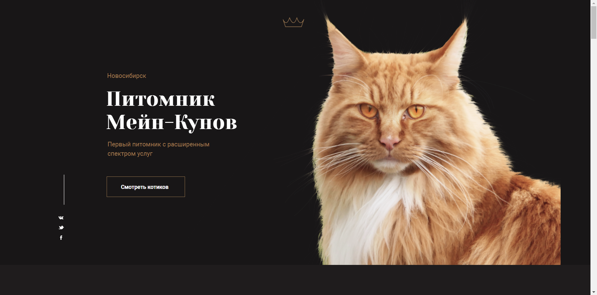

# maincoon-website

## Training project on layout of a static site about cats using the gulp task manager

### to run the project locally, you need to use the default "gulp" command or the "build" command
